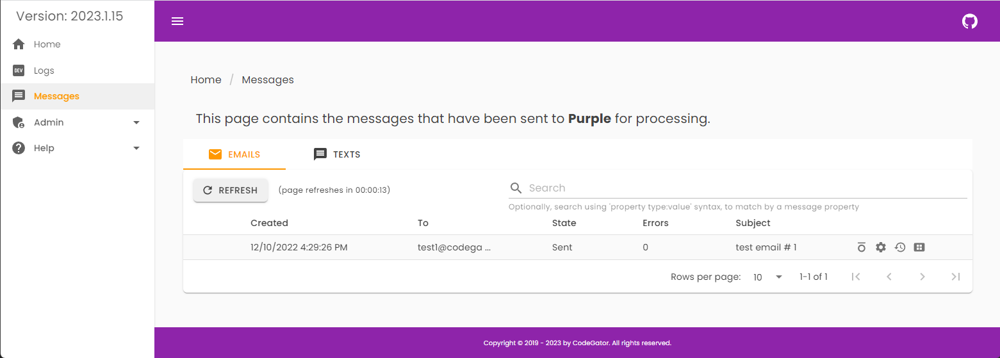

# CG.Purple: 

#### GitHub Stats

### What does it do?

Purple is an idea for a self contained messaging microservice. The scenario is: You give Purple an email, or a text, via a REST call, and it takes care of storing that message, sending it, tracking it's history, and sending you status updates as the message processes.

### What does it look like?

Here is a screen shot (subject to change):

### What platform(s) does it support?

* [.NET 7.x](https://dotnet.microsoft.com/en-us/download/dotnet/7.0) or higher

### What database(s) does it support?

* For now, SqlServer 2019, or higher.

### What 3rd party providers does it support?

* SMTP, SendGrid and Twillio (currently without attachments). Possibly others in the future.

### How do I contact you?

If you've spotted a bug in the code please use the project Issues [HERE](https://github.com/CodeGator/CG.Purple/issues)

We also have a discussion group [HERE](https://github.com/CodeGator/CG.Purple/discussions)

### Is there any documentation?

There is developer documentation [HERE](https://codegator.github.io/CG.Purple/)  (when the blasted CI/CD pipeline works and it gets updated).

We have a WIKI under construction for the project, [HERE](https://github.com/CodeGator/CG.Purple/wiki)

We also write about projects like this one on our website, [HERE](http://www.codegator.com)

### Disclaimer

This project and it's contents are experimental in nature. There is no official support. Use at your own risk.