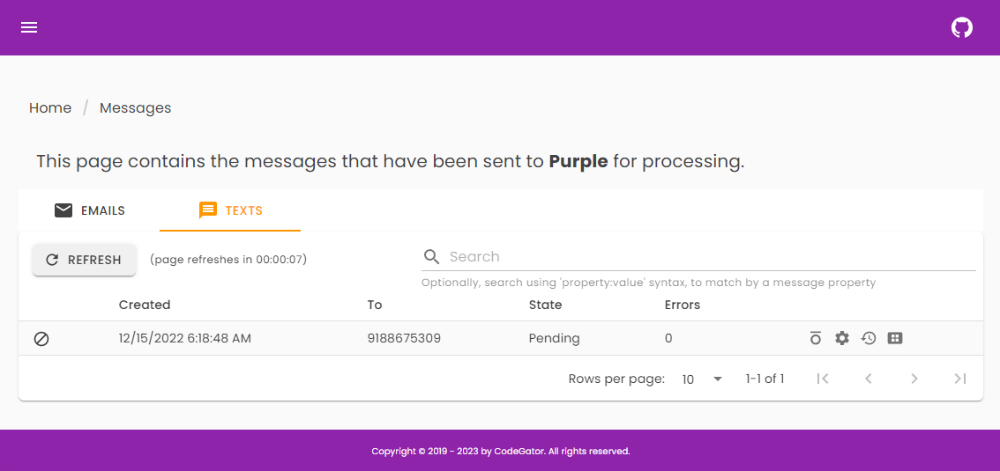

# CG.Purple: 

### What are the design goals?
Purple is an idea for a self contained messaging microservice. The scenario is: You give Purple an email, or a text, via a REST call, and it takes care of storing that message, sending it, and tracking it's history and status, on your behalf.

### What's actually working, at this point?

* The service sends mail and text messages.

* The service handles retry logic, for failed messages.

* The service sends notifications, via SignalR, in real time.

* The service keeps messages for a configurable amount of time. 

* The services has a simple REST interface.

* The service has a simple C# client that wraps the REST interface and makes it ridiculously easy to use the microservice from any C# application.

### What does it look like?
Here are a few early screen shots (subject to change):

Message page:

Mime Type page:

Property Type page:

Parameter Type page:

Provider Type page:

There is also a MAUI based test client that looks like this:

### What platform(s) does it support?
* .NET 7.x or higher

### What database(s) does it support?
* For now, SqlServer 2019, or higher.

### What 3rd party providers does it support?
* For sure, SMTP, Twillio, and SendGrid. Possibly others, who knows.

### How do I contact you?
If you've spotted a bug in the code please use the project Issues [HERE](https://github.com/CodeGator/CG.Purple/issues)

We also have a discussion group [HERE](https://github.com/CodeGator/CG.Purple/discussions)

### Is there any documentation?
There is developer documentation [HERE](https://codegator.github.io/CG.Purple/)  (when the blasted CI/CD pipeline works and it gets updated).

We also blog about projects like this one on our website, [HERE](http://www.codegator.com)

### Can I help with the project?

At some point, hopefully soon, I'll be able to include others in the project. Stay tuned for that.

### Disclaimer
This project and it's contents are experimental in nature. There is no official support. Use at your own risk.